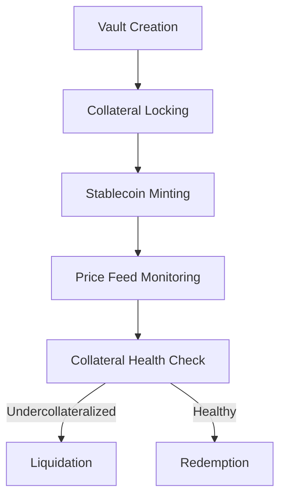

# BitVault Protocol

**Bitcoin-Backed Stablecoin System on Stacks L2**  
_Version 1.0.0 | SIP-010 Compliant_

## Overview

A decentralized finance protocol enabling minting of algorithmic stablecoins (BVP) using Bitcoin as collateral. Combines Bitcoin's security with Stacks L2 scalability through:

- Non-custodial BTC collateralization
- 150% minimum over-collateralization ratio
- Decentralized price oracle network
- Automated liquidation engine
- Governance-controlled parameters

## Key Features

### 1. Collateral Vault System

- Create individual collateral positions with BTC price exposure
- Dynamic minting/redeeming with real-time collateral checks
- Vault-specific risk parameters tracking

### 2. Oracle Integration

- Decentralized BTC/USD price feed system
- Multi-oracle support with permissioned nodes
- Time-weighted price averaging

### 3. Risk Management

- Protocol-wide collateralization ratio (150%)
- Liquidation threshold (125%) with public incentive
- Supply cap enforcement (1,000,000 BVP)

### 4. Governance

- Contract owner parameter control:
  - Collateralization ratios
  - Fee structures
  - Oracle management

## Technical Specification

### Contract Architecture



### Core Functions

#### Vault Operations

- `create-vault`: Initialize new collateral position
- `mint-stablecoin`: Generate BVP against locked collateral
- `redeem-stablecoin`: Burn BVP to release collateral
- `liquidate-vault`: Force close undercollateralized positions

#### Oracle Management

- `add-btc-price-oracle`: Authorize new price feed providers
- `update-btc-price`: Submit BTC/USD price data

#### Governance

- `update-collateralization-ratio`: Adjust risk parameters
- Protocol fee configuration

### Security Model

- Multi-layer collateral checks:
  ```clarity
  assert!(
    (collateral_value * 100) >= (stablecoin_minted * collateralization_ratio),
    ERR_UNDERCOLLATERALIZED
  )
  ```
- Time-locked oracle updates
- Tx-sender validation for vault access
- Overflow/underflow protection

## Development

### Requirements

- Clarinet SDK ≥ 1.5.0
- Stacks node ≥ 2.1.0

### Audit Considerations

- Price oracle manipulation resistance
- Front-running protection
- Collateral valuation rounding
- Governance privilege escalation

## Compliance

- SIP-010 Token Standard
- Stacks L2 Finality Rules
- Bitcoin Transaction Compatibility
